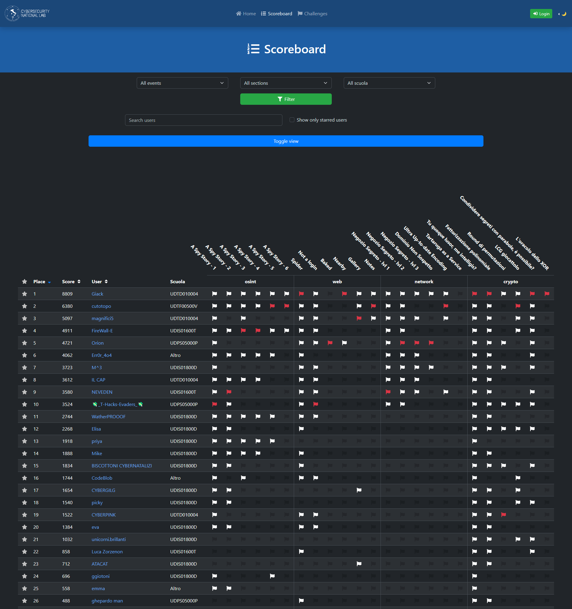

# HighSchools CTF Workshop - Udine

Challenge per l'HighSchools CTF Workshop 2023 di Udine

## Credits

Le challenge qua presenti sono state sviluppate dai membri dei team [madrhacks](https://madrhacks.it/) di Udine per il quinto HighSchools CTF Workshop tenutosi alla Bibloteca Rizzi dell'Università degli Studi di Udine il 12 dicembre 2023.

## Challenges

| Category | Title                                                      | Author                      |      Dynamic       | Type |                                      Url | Port  |
| :------- | :--------------------------------------------------------- | :-------------------------- | :----------------: | ---: | ---------------------------------------: | :---: |
| crypto   | [Tu quoque lusor, me intelligis?](crypto01)                | Luca Campa <@campa1102>     | :heavy_check_mark: | http |        caesar.challs.cyberhighschools.it |  80   |
| crypto   | [Fattorizzazione polinomiale](crypto02)                    | Luca Campa <@campa1102>     | :heavy_check_mark: | http | factorization.challs.cyberhighschools.it |  80   |
| crypto   | [Round di permutazioni](crypto03)                          | Luca Campa <@campa1102>     | :heavy_check_mark: | http |   permutation.challs.cyberhighschools.it |  80   |
| crypto   | [LCG giocattolo](crypto04)                                 | Luca Campa <@campa1102>     | :heavy_check_mark: | http |           lcg.challs.cyberhighschools.it |  80   |
| crypto   | [Condividere segreti con parabole, è possibile?](crypto05) | Luca Campa <@campa1102>     | :heavy_check_mark: | http |     parabolic.challs.cyberhighschools.it |  80   |
| crypto   | [L'oracolo dello XOR](crypto06)                            | Luca Campa <@campa1102>     | :heavy_check_mark: | http |     xororacle.challs.cyberhighschools.it |  80   |
| network  | [Negozio Segreto - lvl 1](network01)                       | Matteo Paier <@MatteoPaier> |        :x:         |      |                                          |       |
| network  | [Negozio Segreto - lvl 2](network02)                       | Matteo Paier <@MatteoPaier> |        :x:         |      |                                          |       |
| network  | [Negozio Segreto - lvl 3](network03)                       | Matteo Paier <@MatteoPaier> |        :x:         |      |                                          |       |
| network  | [Dominio Non Sospetto](network04)                          | Matteo Paier <@MatteoPaier> |        :x:         |      |                                          |       |
| network  | [Ultra Up-to-date Encoding](network05)                     | Matteo Paier <@MatteoPaier> |        :x:         |      |                                          |       |
| network  | [Tartaruga as a Service](network06)                        | Matteo Paier <@MatteoPaier> |        :x:         |      |                                          |       |
| osint    | [A Spy Story - 1](osint01)                                 | Alessandro Zanatta <@kalex> |        :x:         |      |                                          |       |
| osint    | [A Spy Story - 2](osint02)                                 | Alessandro Zanatta <@kalex> |        :x:         |      |                                          |       |
| osint    | [A Spy Story - 3](osint03)                                 | Alessandro Zanatta <@kalex> |        :x:         |      |                                          |       |
| osint    | [A Spy Story - 4](osint04)                                 | Alessandro Zanatta <@kalex> |        :x:         |      |                                          |       |
| osint    | [A Spy Story - 5](osint05)                                 | Alessandro Zanatta <@kalex> |        :x:         |      |                                          |       |
| osint    | [A Spy Story - 6](osint06)                                 | Alessandro Zanatta <@kalex> |        :x:         |      |                                          |       |
| web      | [Spider](web01)                                            | Stefano Pessotto <@peszr>   | :heavy_check_mark: | http |        spider.challs.cyberhighschools.it |  80   |
| web      | [Not a login](web02)                                       | Stefano Pessotto <@peszr>   | :heavy_check_mark: | http |     notalogin.challs.cyberhighschools.it |  80   |
| web      | [Baked](web03)                                             | Stefano Pessotto <@peszr>   | :heavy_check_mark: | http |         baked.challs.cyberhighschools.it |  80   |
| web      | [Nearby](web04)                                            | Stefano Pessotto <@peszr>   | :heavy_check_mark: | http |        nearby.challs.cyberhighschools.it | 37005 |
| web      | [Gallery](web05)                                           | Stefano Pessotto <@peszr>   | :heavy_check_mark: | http |       gallery.challs.cyberhighschools.it |  80   |
| web      | [Notes](web06)                                             | Stefano Pessotto <@peszr>   | :heavy_check_mark: | http |         notes.challs.cyberhighschools.it |  80   |

## Scoreboard

