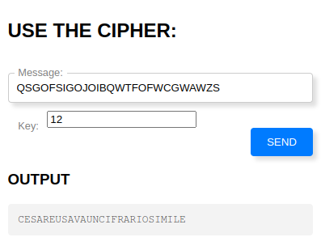

# 5th HighSchools CTF Workshop - Udine 2023

## [crypto] Tu quoque lusor, me intelligis?

Il cifrario utilizzato non è altro che un semplice `ROT K`.
L'alfabeto utilizzato è quello inglese che contiene 26 lettere. Di conseguenza, il numero di possibile chiavi è `26`.

### Come ottenere la flag

Per ottenere la flag, occorre inserire nel campo `messaggio` il testo cifrato che ci viene fornito dal servizio.
A questo punto possiamo applicare un semplificissimo attacco a forza bruta (le possibilità sono 26 quindi semplice da fare), ossia provare tutte le possibile chiavi. Andiamo avanti finchè non riconosciamo un testo sensato all'interno dell'output.

Come si può evincere dall'immagine, la chiave necessaria per ottenere un testo sensato è `12`.

### La flag

`flag{CESAREUSAVAUNCIFRARIOSIMILE}`
