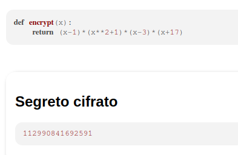
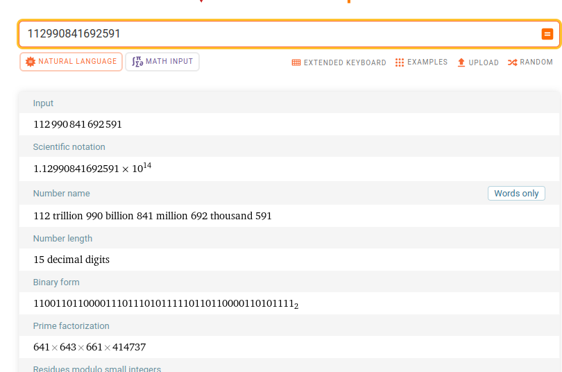

# 5th HighSchools CTF Workshop - Udine 2023

## [crypto] Fattorizzazione polinomiale

### Analisi iniziale

Il servizio ci fornisce la funzione di cifratura, che non è altro che un polinomio fattorizzabile in `4` parti.
Dato un segreto, la funzione di cifratura fornisce la valutazione del polinomio con il suddetto valore. In pratica, sostituisce la variabile `x` con il valore del segreto e ne calcola il risultato (che ci viene fornito dal servizio).

$$P(x) = (x-1) \times (x^2+1) \times (x-3) \times (x+17)$$

### Come ottenere la flag

Dato che il polinomio è fattorizzabile in 4 fattori, anche il valore risultante dalla valutazione del polinomio sarà fattorizzabile in 4 parti. Come possiamo fattorizzarlo? Usiamo `WolframAlpha` (Figura 2).

Il servizio indica che il numero `112990841692591` è fattorizzabile in `641 × 643 × 661 × 414737`.
Il valore più piccolo, ossia `641`, sarà sicuramente il risultato del fattore `x-3`.
Quindi: `x-3 = 641` da cui `x = 644`

In questo modo abbiamo trovato il segreto.
Non ci resta che validarlo e ottenere la flag!

### La flag

`flag{f4tt0r1zz4z10n3_p0l1n0mi4l3}`
