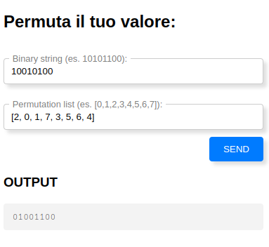

# 5th HighSchools CTF Workshop - Udine 2023

## [crypto] Round di permutazione

### Analisi preliminare

Il servizio ci fornisce:

- il cifrario
- un tool per applicare permutazioni al nostro input

Analizzando il cifrario si può capire che, dato un segreto (in codifica binaria), il cifrario applica 5 permutazioni che scambiano i bit al suo interno ottenendo il segreto cifrato, che ci viene fornito dal servizio.

La sicurezza di un cifrario dipende anche dalla possibilità di poter invertire le operazioni applicate in modo semplice o meno. La permutazione è completamente e, facilmente, invertibile.

`NOTA BENE`: la permutazione viene usata anche in cifrari forti largamente utilizzati oggigiorno. La differenza sta nel fatto che essa viene combinata con altre operazioni che rendono il cifrario molto più difficile da invertire, mentre nel nostro caso viene applicata da sola.

### Come ottenere la flag

Quello che dobbiamo fare è calcolarci le permutazioni inverse di quelle indicate dal codice e applicarle al contrario sul valore cifrato (fornito dal servizio).
Per esempio, data la permutazione `[2,1,3,0,6,5,4,7]`, la sua inversa si può trovare in questo modo. Partiamo da una lista di valori vuoti:

`[_, _, _, _, _, _, _, _]`.

1. Con questa permutazione il valore in posizione `2` finisce in posizione `0`, l'inverso implica che l'elemento in posizione `0` deve finire in posizione `2`: `[_, _, 0, _, _, _, _, _]`

2. Con questa permutazione il valore in posizione `1` finisce in posizione `1`, l'inverso non cambia nulla: `[_, 1, 0, _, _, _, _, _]`

3. Con questa permutazione il valore in posizione `3` finisce in posizione `2`, l'inverso implica che l'elemento in posizione `2` deve finire in posizione `3`: `[_, 1, 0, 2, _, _, _, _]`

4. Con questa permutazione il valore in posizione `0` finisce in posizione `3`, l'inverso implica che l'elemento in posizione `3` deve finire in posizione `0`: `[3, 1, 0, 2, _, _, _, _]`

5. Con questa permutazione il valore in posizione `6` finisce in posizione `4`, l'inverso implica che l'elemento in posizione `4` deve finire in posizione `6`: `[3, 1, 0, 2, _, _, 4, _]`

6. Con questa permutazione il valore in posizione `5` finisce in posizione `5`, l'inverso non cambia nulla:: `[3, 1, 0, 2, _, 5, 4, _]`

7. Con questa permutazione il valore in posizione `4` finisce in posizione `6`, l'inverso implica che l'elemento in posizione `6` deve finire in posizione `4`: `[3, 1, 0, 2, 6, 5, 4, _]`

8. Con questa permutazione il valore in posizione `7` finisce in posizione `7`, l'inverso non cambia nulla:: `[3, 1, 0, 2, 6, 5, 4, 7]`

Quest'operazione va fatta con tutte e 5 le permutazioni del cifrario. Il cifrario applica nell'ordine `P1, P2, P3, P4, P5`. Per ottenere il segreto, dovrò applicare nell'ordine: `P5_inversa, P4_inversa, P3_inversa, P2_inversa, P1_inversa`.

Validate il segreto e avrete ottenuto la flag.

### La flag

`flag{p3rmut4r3_n0n_e_4bb4st4nz4}`
