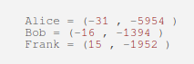

# 5th HighSchools CTF Workshop - Udine 2023

## [crypto] Condividere segreti con parabole, è possibile?

### Analisi preliminare

Il servizio ci dice che il segreto che dobbiamo trovare è il termine noto di un'equazione di secondo grado. Tutti e 4 possiedono uno dei punti sulla curva. In questo modo, con 3 punti (il proprio e 2 degli altri), l'utente può ricostruire l'equazione di secondo grado univocamente. Ricordate infatti che:

- Per 2 punti distinti passono infinite parabole.
- Per 3 punti distinti passa una ed una sola parabola.

### Come ottenere la flag

Il servizio ci fornisce 3 di questi punti. Avendo tre punti possiamo costruire il sistema a tre equazioni che ci permette di recuperare i coefficienti delle equazioni di secondo grado. Ricordate che una parabola ha equazione: $$y = Ax^2 + Bx + C$$.

Ipotizziamo di avere tre punti: `(X1, Y1), (X2, Y2), (X3, Y3)`
Dobbiamo risolvere il seguente sistema:

$$Y_1 = Ax_1^2 + Bx_1 + C$$

$$Y_2 = Ax_2^2 + Bx_2 + C$$

$$Y_3 = Ax_3^2 + Bx_3 + C$$

Per risolverlo, possiamo farlo manualmente oppure utilizzando WolframAlpha.

Una volta trovato il segreto, non ci resta che validarlo e trovare la flag associata.

### La flag

`flag{3_punt1_d3fin1sc0n0_un4_s0l4_3qu4z1on3_di_s3c0nd0_gr4d0}`
