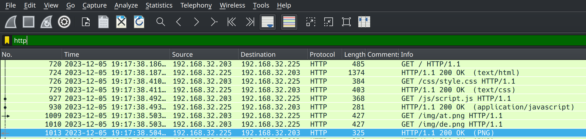
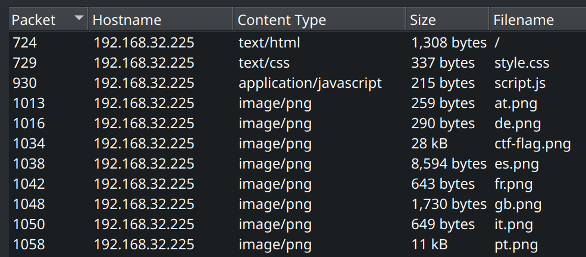
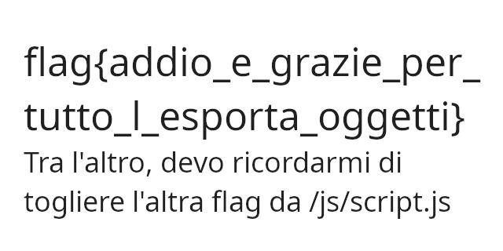

# 5th HighSchools CTF Workshop - Udine 2023

## [network] Secret Flag Shop - lvl 1

Una semplice challenge network per imparare a esportare gli oggetti scambiati in una connessione HTTP.

## Soluzione

Le parti rilevanti della cattura sono le richieste HTTP all'indirizzo `192.168.32.225`.

Questo è evidente dal fatto che filtrando per `http` (la challenge parla di un negozio online), le uniche richieste che vengono trovate sono relative a un web server all'indirizzo in esame.

Nella descrizione viene menzionata una flag che è diversa dalle altre: provando a espotare gli oggetti HTTP si può notare che tra `it.png` e altre bandiere di stati europei, è presente `ctf-flag.png`.

Esportandolo si trova la flag.

