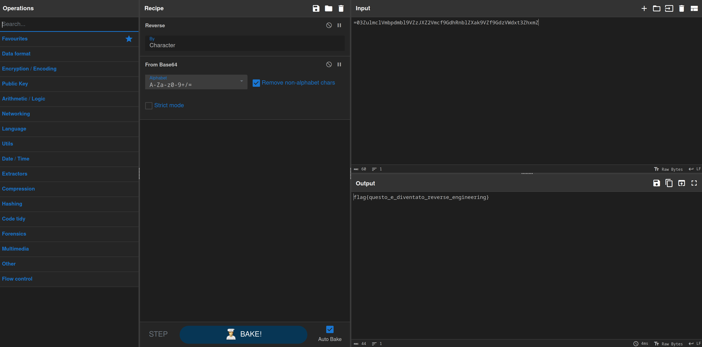

# 5th HighSchools CTF Workshop - Udine 2023

## [network] Negozio Segreto - lvl 2

Una challenge network per mostrare come `network` spesso sia un precursore di altre tipologie di challenge, in questo caso `reversing`.

## Soluzione

Come nel livello precedente, il traffico rilevante è HTTP relativo all'indirizzo `192.168.32.225`.

Dalla soluzione precedente si può trovare un suggerimento: lo script `script.js` è necessario per la challenge.

Esportandolo (o seguendo il flusso HTTP) viene trovato il seguente codice:

```javascript
var messaggio = "=03ZulmclVmbpdmbl9VZzJXZ2Vmcf9GdhRnblZXak9VZf9GdzVWdxt3ZhxmZ";

function decodifica(msg) {
  msg = msg.split("").reverse().join("");
  msg = atob(msg);
  console.log(msg);
}

decodifica(messaggio);
```

La funzione `decodifica` applica delle trasformazioni a un messaggio codificato. Cercando maggiori informazioni su Internet è possibile intuirne il funzionamento:

1. l'ordine dei caratteri del messaggio viene invertito;
2. viene applicata una decodifica base64 al risultato dell'operazione precedente;
3. viene stampato il risultato nella console del browser.

Dal momento che non si ha accesso ai log della console, è necessario reimplementare l'algoritmo.

Questo può essere ottenuto facilmente con CyberChef: [https://gchq.github.io/CyberChef/#recipe=Reverse('Character')From_Base64('A-Za-z0-9%2B/%3D',true,false)&input=PTAzWnVsbWNsVm1icGRtYmw5Vlp6SlhaMlZtY2Y5R2RoUm5ibFpYYWs5VlpmOUdkelZXZHh0M1poeG1a](<https://gchq.github.io/CyberChef/#recipe=Reverse('Character')From_Base64('A-Za-z0-9%2B/%3D',true,false)&input=PTAzWnVsbWNsVm1icGRtYmw5Vlp6SlhaMlZtY2Y5R2RoUm5ibFpYYWs5VlpmOUdkelZXZHh0M1poeG1a>)

La flag è ottenuta dall'output dell'algoritmo.


