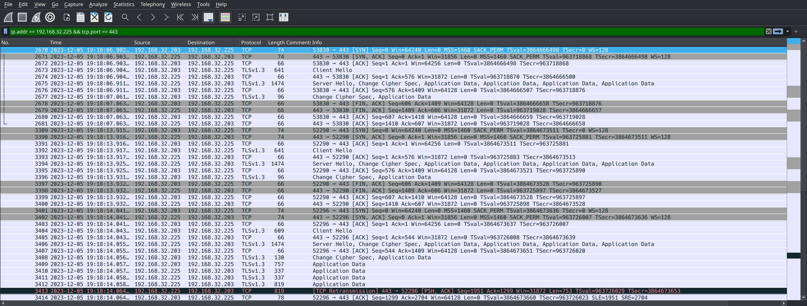
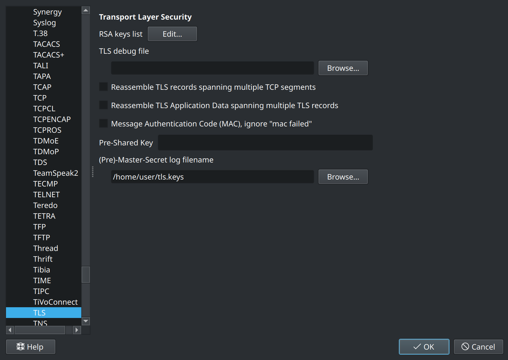
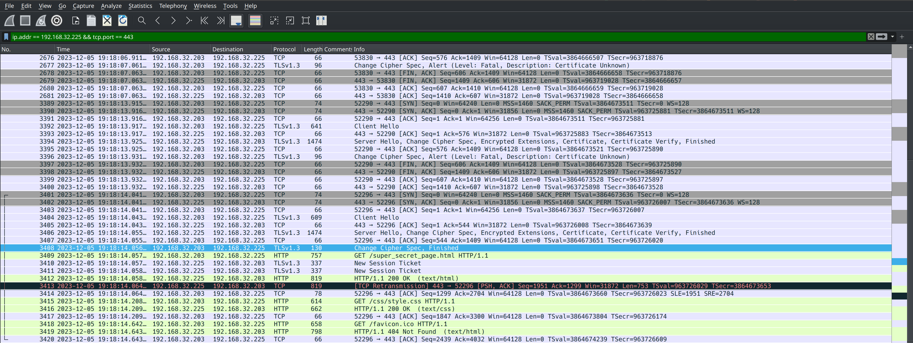
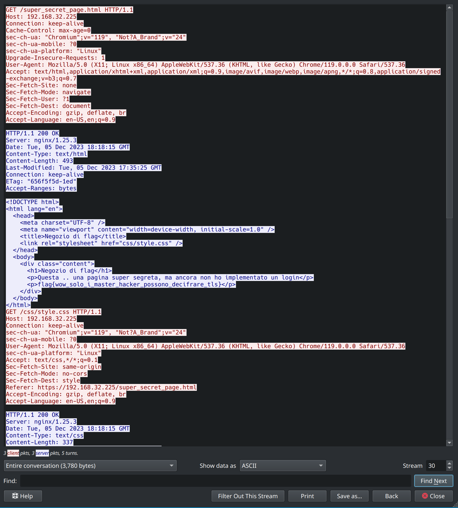

# 5th HighSchools CTF Workshop - Udine 2023

## [network] Negozio Segreto - lvl 3

Questa challenge mostra come Wireshark può decifrare TLS se viene fornito dei segreti corretti.

## Soluzione

Nei livelli precedenti il traffico rilevante era quello HTTP relativo all'indirizzo `192.168.32.225` (porta TCP 80). In questa, invece, è necessario trovare la porta usata da HTTPS (TCP 443) e filtrare il traffico dello stesso host: `ip.addr == 192.168.32.225 && tcp.port == 443`.

Il traffico risulta evidentemente cifrato.

Avendo le chiavi TLS della particolare sessione, è possibile istruire Wireshark a decifrare il traffico. Questo viene impostato in `Edit -> Preferences -> Protocols -> TLS -> Pre Master Secrets Log Filename`.

Ora Wireshark è in grado di capire il contenuto della connessione cifrata.

Seguendo il flusso HTTP è possibile risalire alla flag, contenuta nella pagina `/super_secret_page.html`.

