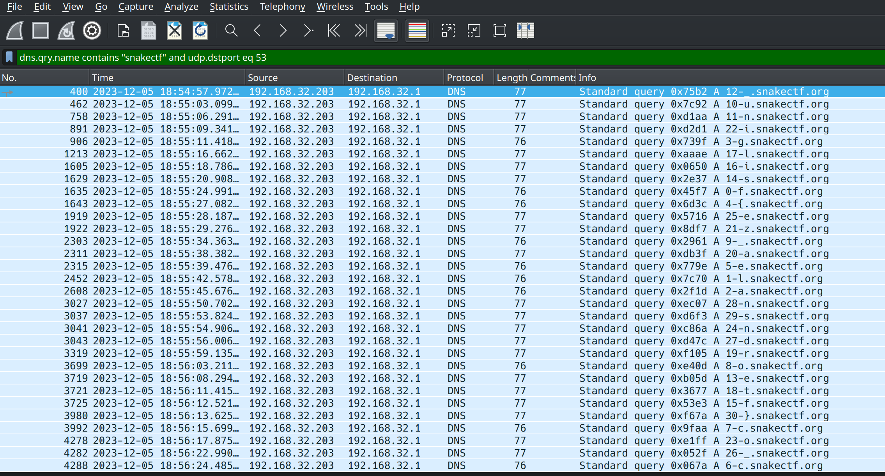

# 5th HighSchools CTF Workshop - Udine 2023

## [network] Dominio Non Sospetto

Questa challenge punta a mostrare il concetto di DNS exfiltration.

## Soluzione

I pacchetti rilevanti sono le query DNS relative a `snakectf.org`. Questo si può intuire dal nome della challenge (il cui acronimo è DNS) e dal fatto che nella descrizione viene descritta una CTF creata dal team MadrHacks.

Il filtro `dns` può essere sufficiente per risolvere la challenge (controllando a mano ogni richiesta rilevante). Un filtro che descrive meglio la challenge può essere: `dns.qry.name contains "snakectf" and udp.dstport eq 53`.



È possibile notare come il sottodominio della query sia composto da due parti, separate da un `-`:

1. un numero
2. un carattere

Si può intuire (`0 -> f`, `1 -> l`, `30 -> }`) che è necessario riordinare i caratteri in base al numero precedente.

La flag è ottenuta applicando il procedimento su tutte le query.

## Script

Questa challenge è risolvibile in maniera automatica con il seguente script:

```python
from scapy.all import *

capture = rdpcap("dominio_non_sospetto.pcap")

exfil_data = []
for packet in capture:
    if packet.haslayer(DNSQR) and b"snakectf.org" in packet[DNSQR].qname:
        exfil_data.append(packet[DNSQR].qname[: -len(b".snakectf.org") - 1].split(b"-"))

exfil_flag = [""] * len(exfil_data)

for pos, char in exfil_data:
    exfil_flag[int(pos)] = char.decode()

exfil_flag = "".join(exfil_flag)
print(exfil_flag)
```
