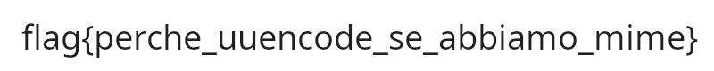

# 5th HighSchools CTF Workshop - Udine 2023

## [network] Ultra Up-to-date Encoding

Questa challenge intende mostrare come le email possono effettuare l'encoding di file binari in allegato.

## Soluzione

La cattura contiene una semplice sessione SMTP in cui viene inviata una email con un allegato.

Seguendo lo stream TCP relativo al traffico SMTP, vengono mostrati tutti i pacchetti scambiati.

In uno di questi è presente la stringa `begin 644 flag.png`: cercandola su un motore di ricerca è possibile imbattersi in risultati relativi a `uuencode`. Questa codifica è suggerita anche dal titolo della challenge (l'acronimo è uuencoding).

Estraendo (copia e incolla) il contenuto uuencoded e decifrandolo con un tool online (e.g. https://www.webutils.pl/UUencode) viene trovata la flag.

