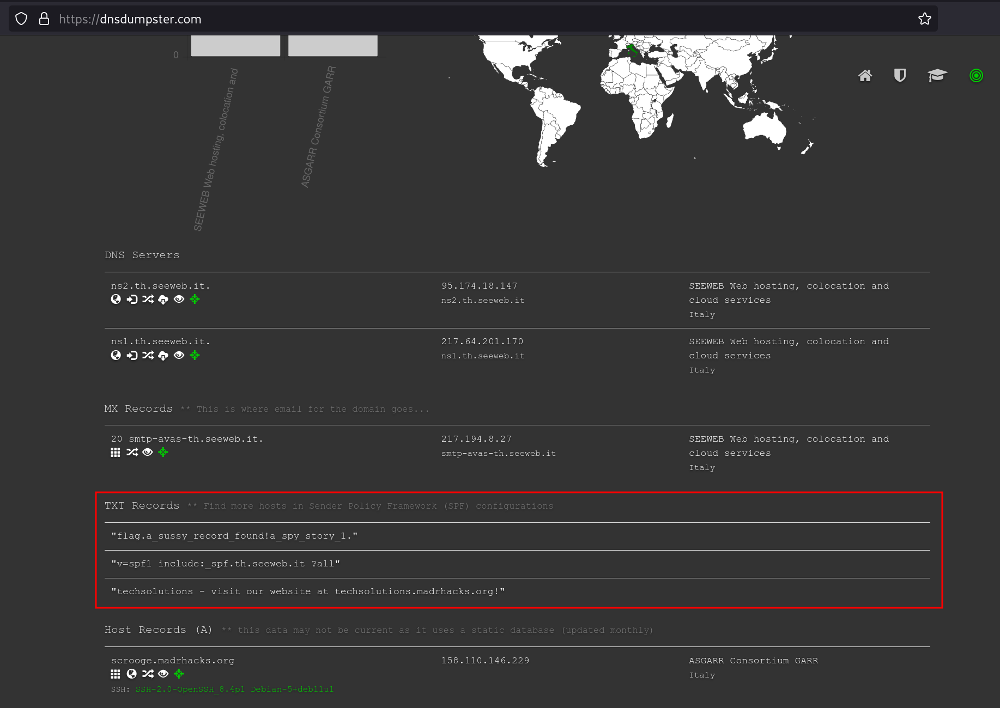

# 5th HighSchools CTF Workshop - Udine 2023

## [osint] A Spy Story - 1

### Soluzione

Come da descrizione, possiamo cercar di estrapolare delle informazioni riguardanti il dominio `madrhacks.org`.

Per farlo possiamo utilizzare [tool online](https://dnsdumpster.com/) o `dig`. Fra i TXT record (`dig -t TXT madrhacks.org`) possiamo trovare la flag, assieme ad un hint per la challenge successiva.

