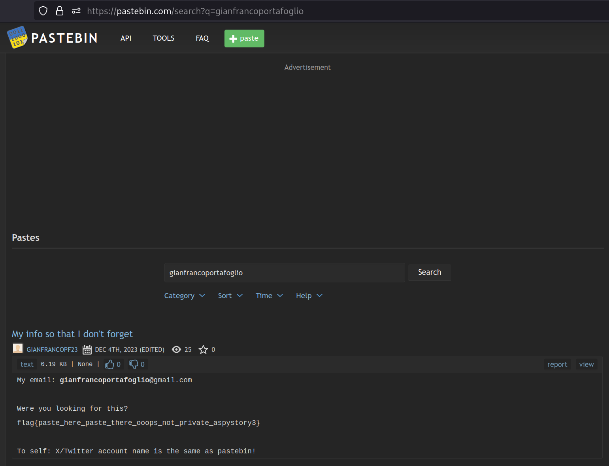

# 5th HighSchools CTF Workshop - Udine 2023

## [osint] A Spy Story - 3

### Soluzione

Da alcuni hint del livello precedente, come il logo presente sul sito, e dalla descrizione si può intuire che siamo alla ricerca di un [pastebin](pastebin.com).
Il pastebin non è indicizzato (al momento di scrittura della writeup) da Google, pertanto è necessario cercare il pastebin direttamente su pastebin.com.

Cercando la mail trovata nello step precedente, o parte di essa (e.g. solo il nome utente), è possibile trovare un pastebin che contiene la flag, oltre ad un hint per la challenge successiva.

