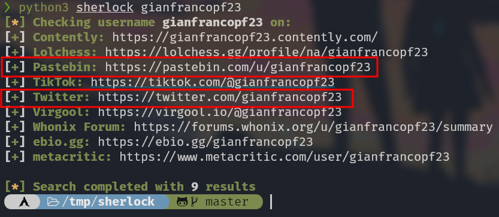
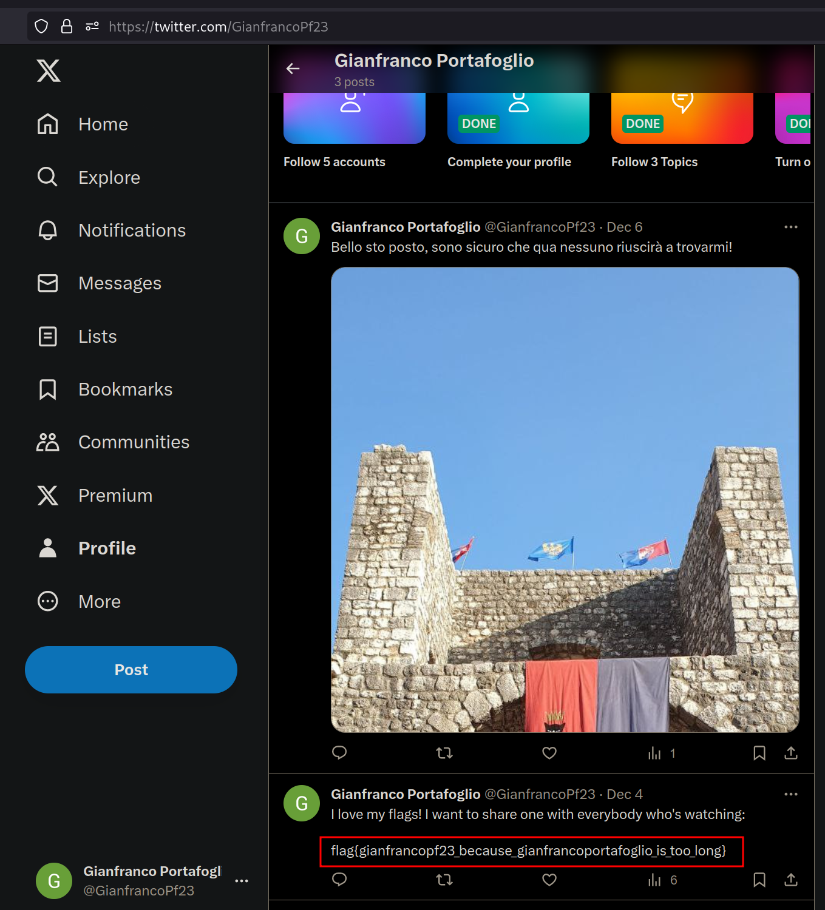

# 5th HighSchools CTF Workshop - Udine 2023

## [osint] A Spy Story - 4

### Soluzione

Dal pastebin del livello precedente possiamo dedurre che il nickname su X/Twitter del sospetto è GianfrancoPf23.

Usando un tool come [Sherlock](https://github.com/sherlock-project/sherlock.git) (o a mano) è possibile trovare il [profilo su X/Twitter](https://twitter.com/GianfrancoPf23).

Fra i suoi post possiamo trovare la flag, assieme ad una foto per il livello successivo.

