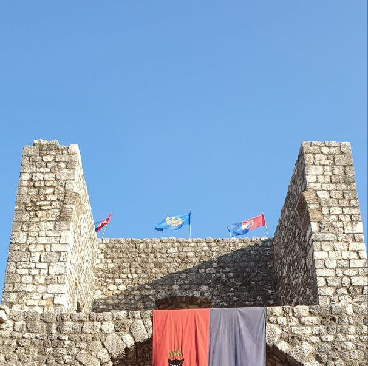
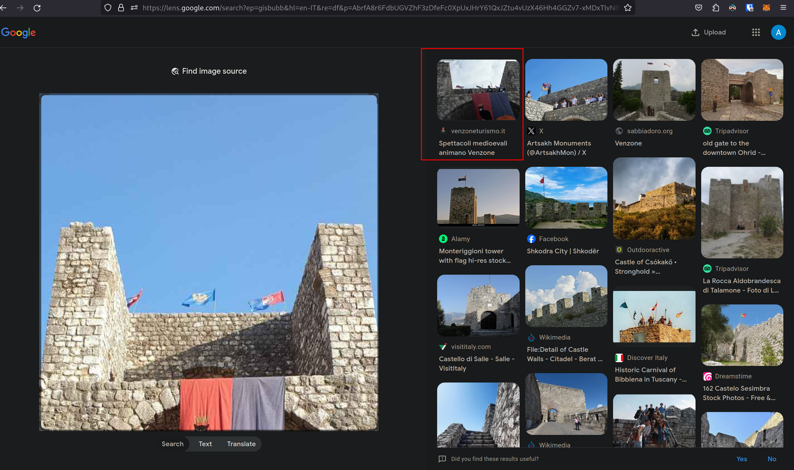
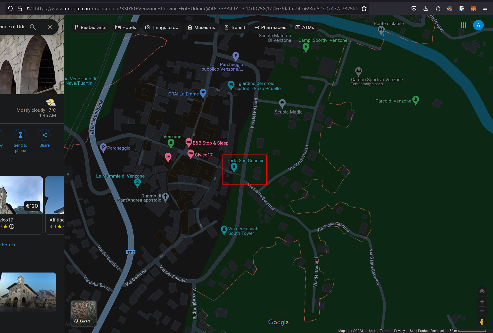
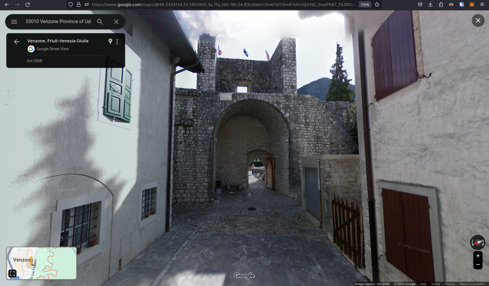

# 5th HighSchools CTF Workshop - Udine 2023

## [osint] A Spy Story - 5

### Soluzione

Dalla challenge precedente abbiamo trovato la foto scattata dal sospettato.

Utilizzando Google Images è possibile trovare che il posto dove la foto è stata scattata è Venzone (provincia di Udine, durante la Festa della Zucca).

Una volta trovata la città bisogna identificare la porta. È possibile trovare il nome utilizzando street view di Google o, alternativamente, cercando sulla cartina fornita da Google Maps. Essendoci diverse porte è necessario identificare la porta corretta, fattibile dato che ognuna è chiaramente diversa dalle altre.

La porta corretta è quella di San Genesio, che si trova qui:

Con Street View possiamo confermare che è la porta corretta:

