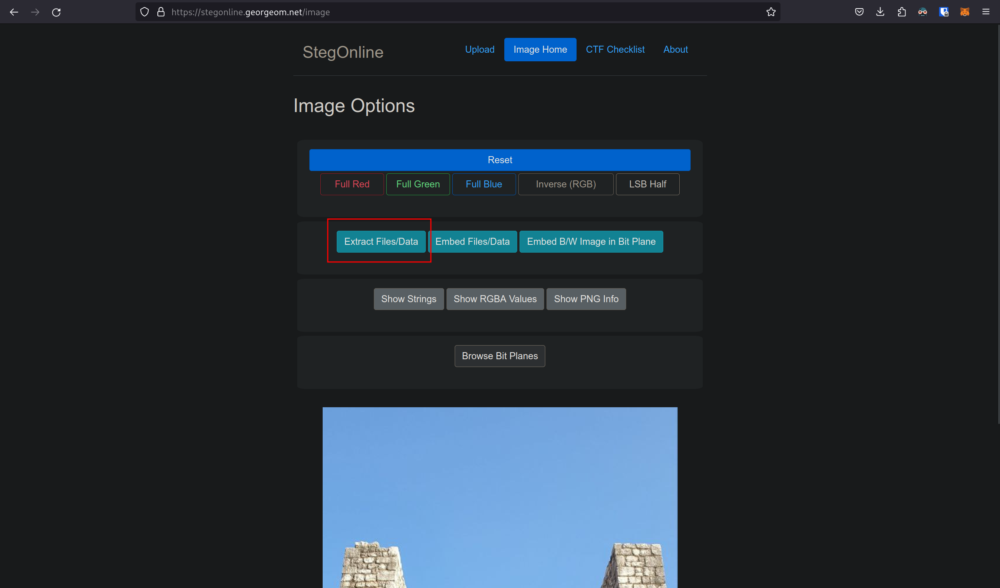
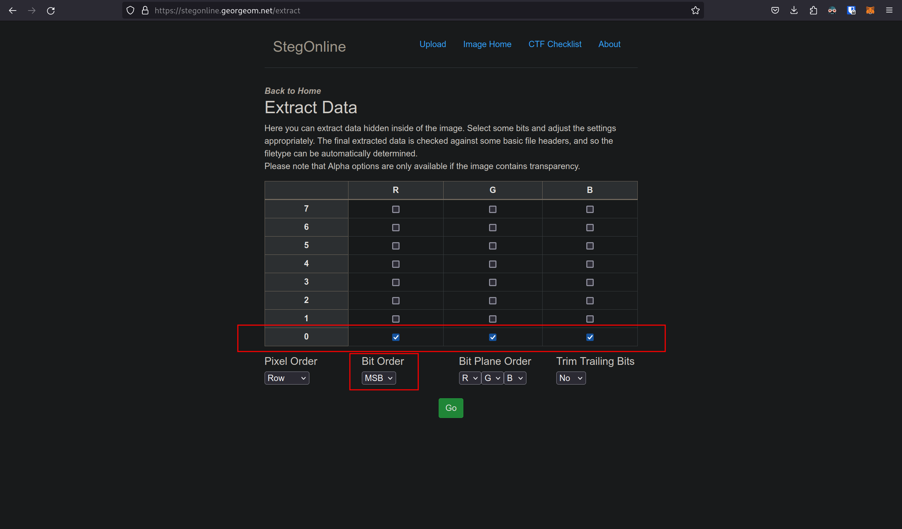
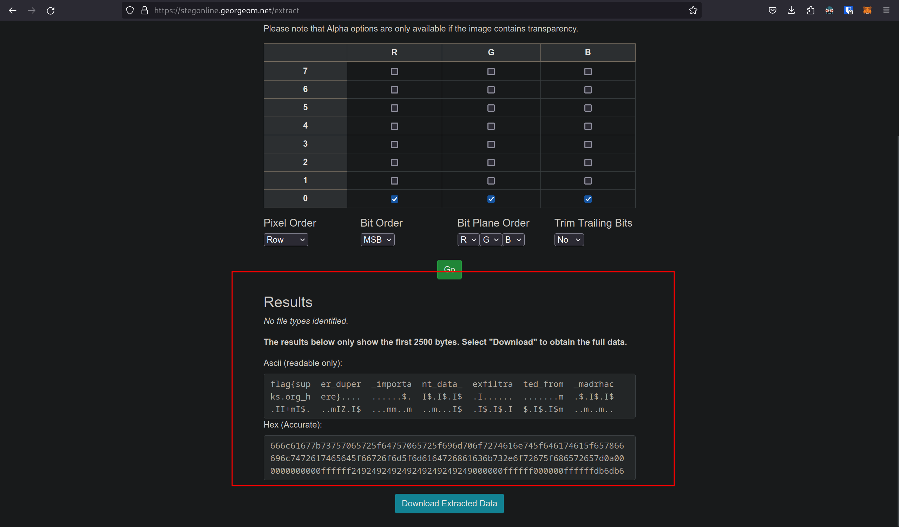

# 5th HighSchools CTF Workshop - Udine 2023

## [osint] A Spy Story - 6

### Soluzione

Dalla descrizione possiamo intuire che l'immagine che abbiamo trovato su Twitter potrebbe contenere altri dati nascosti. Cercando su Google possiamo scoprire che un modo noto di nascondere dati dentro una immagine è la [steganografia](https://it.wikipedia.org/wiki/Steganografia). Un esempio classico di steganografia consiste nell'utilizzare i Least Significant Bit (LSB) dei pixel di una immagine per nascondere dati. Modificare gli LSB di una immagine cambia in maniera impercettibile i colori di una immagine, rendendo molto difficile (impossibile) riconoscere l'uso di questa tecnica ad occhio nudo.

Per estrarre le informazioni nascoste in questa maniera possiamo utilizzare [tool online](https://stegonline.georgeom.net) che ci permettono di estrarre questi dati.
In particolare, caricando l'immagine ottenuta da Twitter su questo tool

e utilizzando la funzione di estrazione dati per estrarre dati dai LSB di tutti e tre i canali RGB

possiamo trovare la flag.

