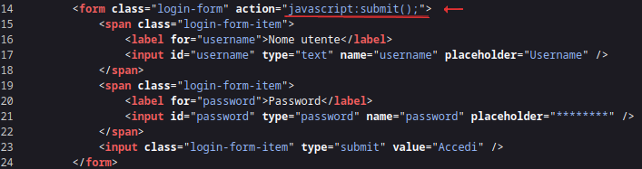
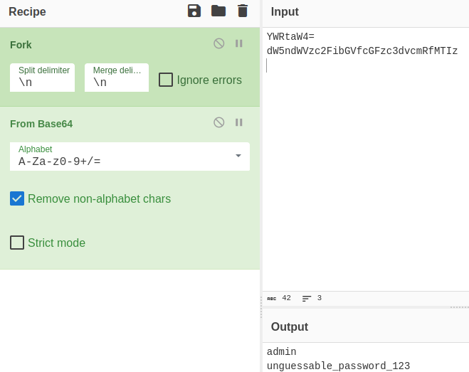

# 5th HighSchools CTF Workshop - Udine 2023

## [web] not a login

Come non fare un login.

Site: [http://notalogin.challs.cyberhighschools.it](http://notalogin.challs.cyberhighschools.it)

### Soluzione

La pagina principale del sito ci riporta ad una schermata di login che riporta la frase

> Effettua l'accesso per avere la flag.

Leggendo il codice sorgente della pagina, si nota che l'attributo `action` del form ha valore `javascript:submit();`.


L'attributo [action](https://www.w3schools.com/jsref/prop_form_action.asp) del form specifica dove la richiesta deve essere inviata.
Il fatto che lo [schema](https://en.wikipedia.org/wiki/List_of_URI_schemes) dell'url sia `javascript:` indica che verrà eseguito del codice `javascript` al submit del form.
Ciò significa che al submit del form, quindi premendo il tasto login, verrà eseguita la funzione javascript `submit`.

Dallo stesso codice sorgente notiamo che è importato uno script `main.js`, in cui è definita tale funzione:

```javascript
async function submit() {
  const u = btoa(window.username.value);
  const p = btoa(window.password.value);
  // Fetch users
  let response = await fetch("/api/users.php");
  const users = await response.json();
  // Check credentials
  possible_users = users.filter((x) => x.username === u && x.password === p);
  if (possible_users.length > 0) {
    const user = possible_users[0];
    document.cookie = `username=${window.username.value};SameSite=Strict;`;
    document.cookie = `password=${window.password.value};SameSite=Strict;`;
    window.location.href = "/";
  } else {
    alert("Invalid credentials");
  }
}
```

La funzione `submit`:

- prende le credenziali fornite nel form tramite l'oggetto [window](https://www.w3.org/TR/2011/WD-html5-20110525/browsers.html#named-access-on-the-window-object);
- applica la funzione [btoa](https://developer.mozilla.org/en-US/docs/Web/API/btoa), ottenendo il [base64](https://it.wikipedia.org/wiki/Base64) delle credenziali;
- ottiene la lista degli utenti tramite una richiesta alla pagina `/api/users.php`;
- filtra la lista degli utenti cercando quello con le credenziali fornite;
- qualora trovi un risultato, imposta i cookie `username` e `password` alle credenziali fornite nel form.

Per risolvere la challenge possiamo effettuare una richiesta a `/api/users.php`, ottenendo così la lista degli utenti, con le relative credenziali:

```json
[{ "username": "YWRtaW4=", "password": "dW5ndWVzc2FibGVfcGFzc3dvcmRfMTIz" }]
```

Possiamo ora decodificare username e password da base64 con la funzione `atob`, o utilizzando [cyberchef](https://gchq.github.io/CyberChef/), ottenendo lo username `admin` e la password `unguessable_password_123`.


Effettuando il login con queste credenziali ci viene ritornata la flag.
