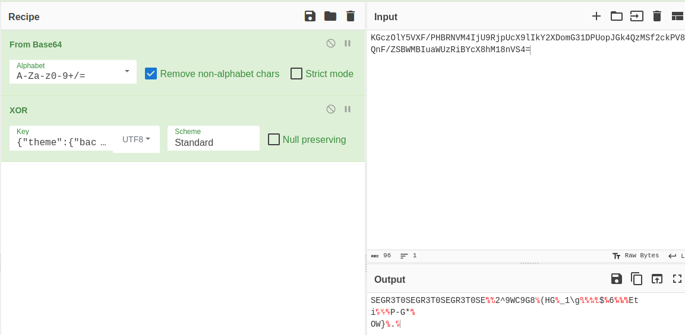
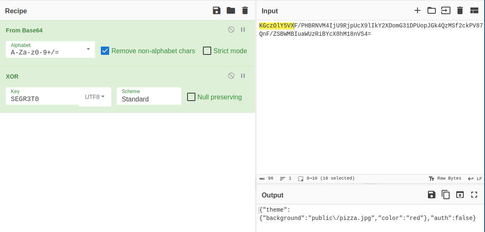
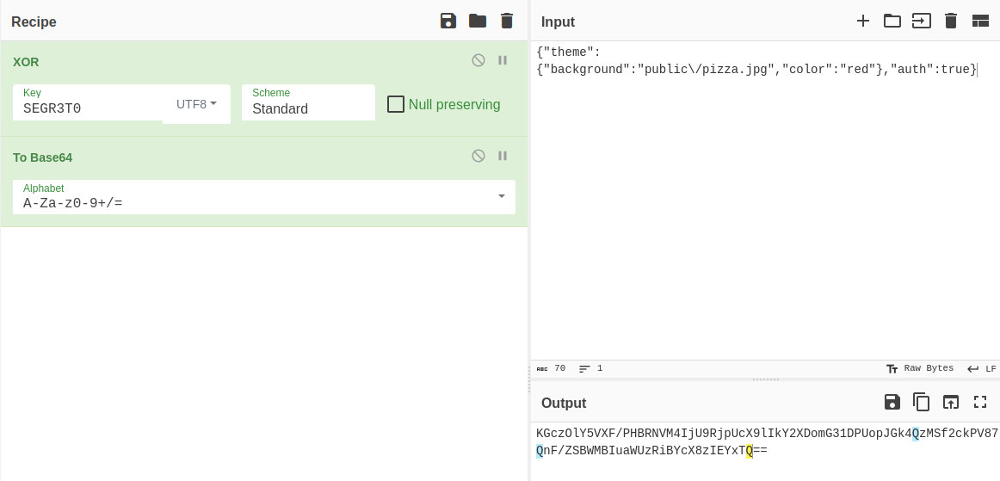

# 5th HighSchools CTF Workshop - Udine 2023

## [web] Baked

Scegli il tuo tema preferito!

Site: [http://baked.challs.cyberhighschools.it](http://baked.challs.cyberhighschools.it)

### Soluzione

La challenge si presenta come una pagina web con due pulsanti che permettono di cambiare tema.

Dal codice sorgente possiamo vedere come è utilizzato il cookie `session`: questo è gestito tramite le due funzioni `saveConf` e `loadConf`, che si occupano di salvare/caricate il cookie.
In questo cookie è salvato un oggetto `session_data`, composto dai due campi `theme` e `auth`.

```php
function saveConf($data) {
    setCookie('session', base64_encode(enc($_ENV['KEY'], json_encode($data))));
}
function loadConf() {
    return json_decode(enc($_ENV['KEY'], base64_decode($_COOKIE['session'])));
}
```

Da queste due funzioni capiamo che il cookie salvato è la codifica in [base64](https://it.wikipedia.org/wiki/Base64) di un oggetto [json](https://it.wikipedia.org/wiki/JavaScript_Object_Notation) a cui è applicata una funzione `enc` con una chiave `KEY`.

Continuando a leggere il codice sorgente notiamo che per ottenere la flag dobbiamo riuscire a modificare il valore del campo `auth` dell'oggetto `session_data` a `true`:

```php
if ($session_data->auth){
    echo "Ben fatto, ecco la flag " . $_ENV['FLAG'];
}

```

L'unico modo per modificare arbitrariamente `session_data` è attraverso il cookie `session` a seguito della lettura tramite la funzione `loadConf`:

```php
$session_data = loadConf();
```

Analizzando la funzione `enc` notiamo che l'encryption è un semplice `xor` tra una chiave ripetuta e i dati (nel nostro caso, il `json` contenente la codifica di `session_data`):

```php
function enc($key, $data) {
    $times = ceil(strlen($data) / strlen($key));
    $secret = str_repeat($key, $times); // Ripeti la chiave per tutti i dati
    $result = '';
    for ($i = 0; $i < strlen($data); ++$i){
        $result = $result . ($data[$i] ^ $secret[$i]);
    }
    return $result;
}
```

Siccome la cifratura è uno `xor` con una chiave ripetuta, se conoscessimo parti dell'oggetto `session_data` potremmo provare a recuperare parti della chiave. Il seguente pezzo di codice descrive come è fatto l'oggetto:

```
$themes = array(
    "christmas" => (object)array("background" => "public/christmas.jpg", "color" => "red"),
    "pizza" => (object)array("background" => "public/pizza.jpg", "color" => "green"),
);

$auth = False;
$theme = $themes['christmas'];

$session_data = new stdClass();
$session_data->theme = $theme;
$session_data->auth = $auth;
```

Capiamo quindi che ha un campo `theme` con le proprietà `background` e color `color` con valore `red` o `green`, possiamo ottenere un pezzo della chiave. Possiamo quindi ricostruire l'inizio della codifica json di `session_data` come `{"theme":{"background":`. Per semplicità potremmo anche eseguire il codice sopra in php, stampando la codifica con l'istruzione `print json_encode($session_data);`.

Procediamo quindi copiando il valore del cookie su `cyberchef`, applichiamo la decodifica `base64` e lo `xor` con il valore `{"theme":{"background":` in **UTF8**.


Notiamo subito che la parte di chiave ottenuta contiene in verità tutta la chiave: poichè questa è più corta della stringa con cui abbiamo fatto lo `xor` la vediamo ripetuta più volte.

Sapendo quindi che la chiave è la parola `SEGR3T0`, riapplichiamo lo `xor` con questa e otteniamo il json di `session_data`.


A questo punto:

- modifichiamo il json perchè `auth` sia `true`;
- riapplichiamo lo xor con `SEGR3T0` in **UTF8**;
- codifichiamo il tutto in `base64`;



Impostando il risultato come cookie di `session` otteniamo la flag.
