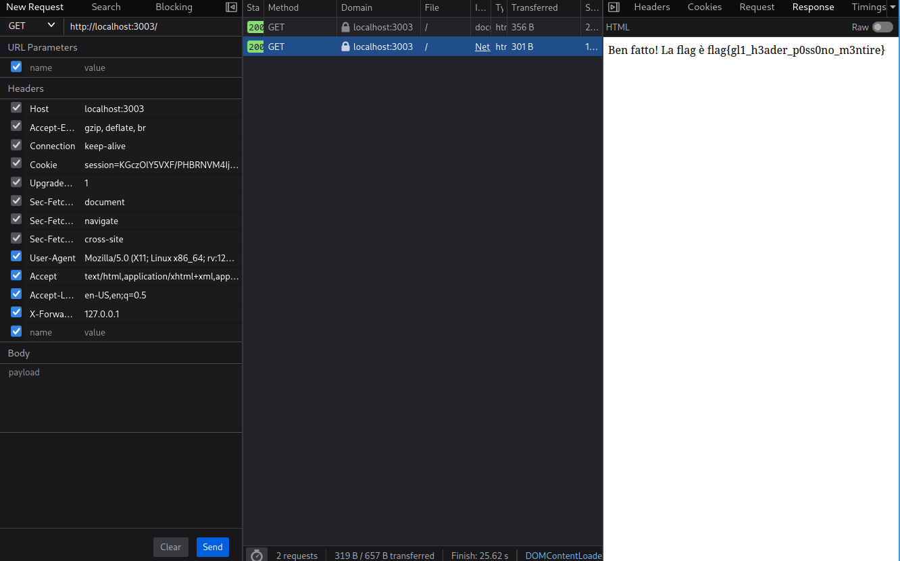

# 5th HighSchools CTF Workshop - Udine 2023

## [web] Nearby

Ho fatto una challenge accessibile solo agli utenti locali. E' sicura, vero?

Site: [http://nearby.challs.cyberhighschools.it:37005](http://nearby.challs.cyberhighschools.it:37005)

### Soluzione

La pagina web riporta il seguente testo:

> Questa pagina è abilitata solo agli utenti locali. Non è accessibile da remoto.
> Il tuo ip potrebbe essere XXX.XXX.XXX.XXX.

Dal testo capiamo che il controllo per l'accesso è effettuato in base all'[ip](https://it.wikipedia.org/wiki/Indirizzo_IP).
Per aggirare questo controllo, possiamo usare uno degli header utili a identificare l'origine della richiesta, come [X-Forwarded-For](https://developer.mozilla.org/en-US/docs/Web/HTTP/Headers/X-Forwarded-For) o [Forwarded](https://developer.mozilla.org/en-US/docs/Web/HTTP/Headers/Forwarded).

Modifichiamo quindi la richiesta aggiungendo l'header `X-Forwarded-For: 127.0.0.1` ([localhost](https://it.wikipedia.org/wiki/Localhost)) otteniamo la flag.

