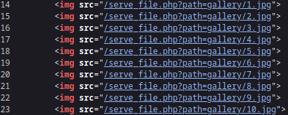
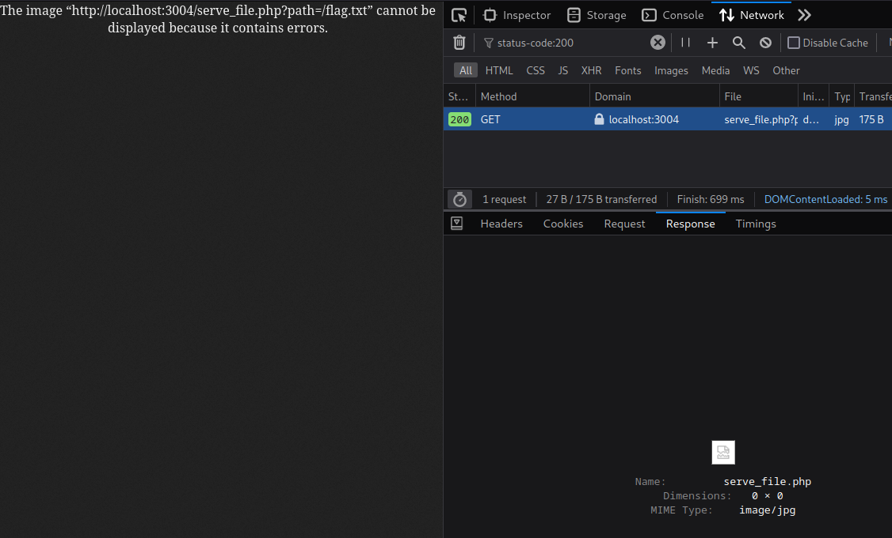
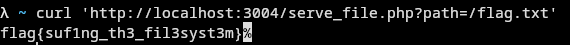

# 5th HighSchools CTF Workshop - Udine 2023

## [web] Gallery

A te piacciono i gatti?
La flag si trova in `/flag.txt`.

Site: [http://gallery.challs.cyberhighschools.it](http://gallery.challs.cyberhighschools.it)

### Soluzione

Dal codice sorgente della pagina notiamo che le immagini sono caricate tramite un endpoint `serve_file.php`, a cui è passato un parametro `path` che specifica il percorso dell'immagine da ottenere.

Questo endpoint è vulnerabile a [Directory Traversal Attack](https://it.wikipedia.org/wiki/Directory_traversal_attack), ed effettuando una richiesta a con `path=/flag.txt` otteniamo la flag.

Poichè la risposta contiene l'header `Content-Type: image/jpeg` ([Content-Type](https://developer.mozilla.org/en-US/docs/Web/HTTP/Headers/Content-Type)), non è visualizzata nella pagina del browser.

Possiamo ottenere il contenuto in diversi modi, ad esempio

- copiando la risposta tramite la tab `Network`;
- aprendo il file tramite la tab `Sources`;
- ripetendo la richiesta da linea di comando, ad esempio con il programma [curl](https://curl.se/docs/manpage.html).

