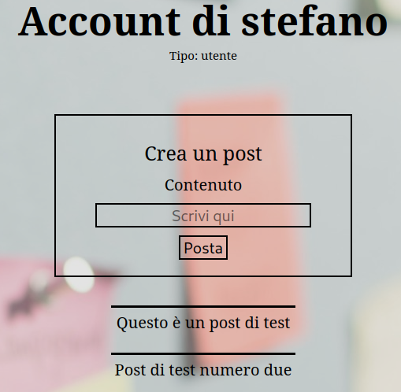

# 5th HighSchools CTF Workshop - Udine 2023

## [web] Notes

Una semplice app per ricordarsi le cose.

Site: [http://notes.challs.cyberhighschools.it](http://notes.challs.cyberhighschools.it)

### Soluzione

La challenge si presenta come una semplice app per salvare dei post.
Iniziamo creando un account e accedendo.
Dopo il login veniamo reindirizzati ad una pagina di account in cui possiamo creare dei post.


Analizzando il codice sorgente si può notare che l'endpoint utilizzato per visualizzare un account non effettua controlli sull'accesso, ovvero non controlla che l'id dell'utente che ha effettuato l'accesso e l'id dell'account da visualizzare siano lo stesso.

```python
@app.get("/account/<int:id>")
@authenticated
def account_from_id(id):
    cur = conn.cursor()
    try:
        cur.execute("SELECT * FROM users WHERE id = ?", (id,))
        row = cur.fetchone()
        if row is None:
            return render_template("404.html")
        user = {
            "id": row[0],
            "username": row[1],
            "password": row[2],
            "is_admin": row[3],
        }
        cur.execute("SELECT content FROM posts WHERE user_id = ?", (user["id"],))
        posts = cur.fetchall()
        posts = [x[0] for x in posts]
        return render_template("account.html", user=user, posts=posts)
    except mariadb.Error as e:
        return str(e)
    return render_template("404.html")
```

La funzione prende l'`id` dal percorso della richiesta, estrae le informazioni dal database e le visualizza nella pagina tramite la funzione `render_template`.

Questo è soggetto ad una vulnerabilità di tipo [IDOR](https://portswigger.net/web-security/access-control/idor). Cambiando l'`id` dell'utente nell'url possiamo visualizzare i lost degli altri utenti senza autenticarci con le loro credenziali.

In particolare, con il percorso `/account/1`, possiamo vedere i post dell'utente admin, tra cui troviamo la flag.
